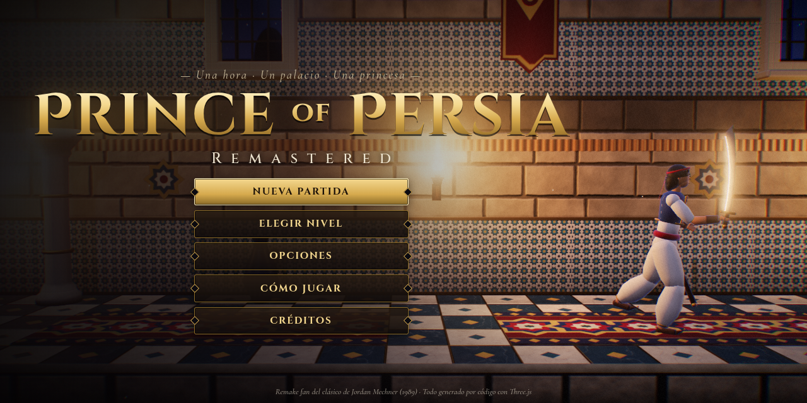
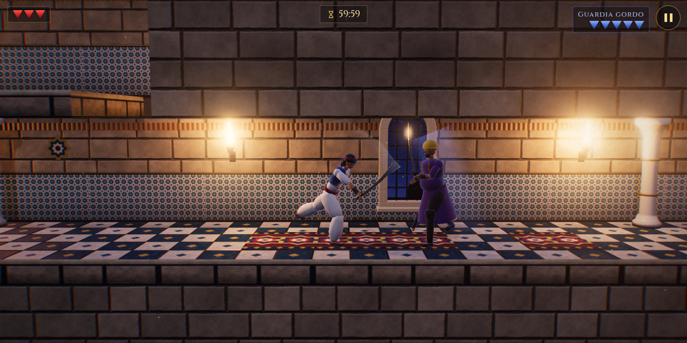

# Prince of Persia · Remastered

Remake fan en 3D del clásico **Prince of Persia** (Jordan Mechner, 1989), hecho con **Three.js r186** para jugar en el navegador del móvil o del ordenador.

Mantiene la jugabilidad del original: el reloj de **60 minutos**, saltos medidos baldosa a baldosa, bordes a los que agarrarse, baldosas sueltas, pinchos, cuchillas, rastrillos con placas de presión, pociones y combates a espada. Todo lo demás está rehecho en 3D: los personajes con esqueleto y animación, los escenarios con luz de antorchas y sombras, los efectos, la música y los sonidos.

**No usa ningún recurso externo:** texturas, modelos, animaciones, música y efectos de sonido se generan por código al cargar el juego.




## Cómo jugarlo

Es una web estática: hay que servirla por HTTP (abrir `index.html` con doble clic no funciona porque el navegador bloquea los módulos JavaScript).

```bash
cd princeofpersian
python3 -m http.server 8000
# abre http://localhost:8000/ en Chrome, Edge, Firefox o Safari
```

No hay que instalar nada ni compilar: Three.js está incluido en `vendor/three/` y las fuentes en `fonts/`. Funciona sin conexión.

### En el móvil

- Se juega en **horizontal**. Al pulsar «Nueva partida» se pone en pantalla completa y se bloquea la orientación (Android). En vertical aparece un aviso para girar el móvil.
- **Cruceta** (izquierda): correr, saltar hacia arriba (↑), agacharse o descolgarse (↓).
- **SALTAR**: salto hacia delante (con carrerilla es un salto largo).
- **ACCIÓN**: coger y beber, paso con cuidado (ACCIÓN + dirección), agarrarse al caer y atacar con la espada. La etiqueta del botón cambia según lo que puedas hacer.
- En combate, **SALTAR** se convierte en **PARAR**. Con la «Ayuda en combate» (activada de serie en pantallas táctiles) el príncipe también para algunos golpes por sí solo.
- En iPhone, Safari no permite pantalla completa: usa **Compartir → Añadir a pantalla de inicio** y se abrirá como una app (el juego es una PWA).

### Con teclado o mando

| Acción | Teclado |
|---|---|
| Correr | ← → (A D) |
| Saltar hacia delante | Espacio (Z) |
| Saltar hacia arriba / trepar | ↑ (W) |
| Agacharse / descolgarse | ↓ (S) |
| Acción: coger, beber, paso con cuidado, atacar | Mayús (X, J) |
| Pausa | Esc (P) |
| Silenciar la música | M |

En combate: **ACCIÓN** ataca, **↑** para (bloquea) el golpe enemigo, **→ / ←** avanza o retrocede y **↓** envaina. Tras una parada, atacar enseguida es un contraataque más rápido. El juego también funciona con mando (stick o cruceta, A saltar, X/B acción).

## Los niveles

Los **14 niveles son los del juego original**: misma distribución de salas, pasillos, trampas, rastrillos, placas, pociones y guardias, con su nueva piel en 3D. También están los momentos especiales de cada nivel:

| Nivel | Nombre | Lo que te espera |
|---|---|---|
| 1 | Las Mazmorras | Caes a la mazmorra sin espada: encuéntrala entre baldosas sueltas, pinchos y rastrillos |
| 2 | Los Calabozos | Cinco guardias, pociones (no todas buenas) y muchos caminos sin salida |
| 3 | El Guardián de Huesos | Cuchillas, punto de control y el **esqueleto** que despierta junto a la salida: no se le puede matar |
| 4 | El Espejo | Al abrir la salida aparece el **espejo mágico**: atraviésalo de un salto y nacerá tu sombra |
| 5 | El Ladrón de Sombras | Tu sombra se cuela tras un rastrillo y se bebe la poción antes que tú |
| 6 | El Abismo | El guardia gordo, tu sombra al otro lado de un rastrillo… y un salto al vacío que lleva al nivel 7 |
| 7 | La Caída | Llegas cayendo. Cuchillas, placas que cierran rastrillos y la poción verde de la pluma |
| 8 | El Ratón de la Princesa | Con la salida abierta, espera: un ratoncito blanco viene a ayudarte |
| 9 | El Mundo del Revés | Cuchillas, muchas placas y la poción que pone el mundo patas arriba |
| 10 | Los Salones del Palacio | Baldosas sueltas, rastrillos encadenados y cinco guardias |
| 11 | Las Baldosas Traicioneras | Casi cincuenta baldosas sueltas y pasillos de pinchos |
| 12 | La Torre de la Sombra | Coge la espada del suelo y tu sombra caerá del techo: herirla te hiere a ti. Envaina, únete a ella y cruza el puente invisible |
| 13 | Jaffar | El techo se derrumba a tu paso y te espera el gran visir |
| 14 | La Princesa | Corre a través de los rastrillos hasta los brazos de la princesa |

La partida se guarda al empezar cada nivel (nivel, minutos restantes, vida máxima y espada). «Continuar» la retoma y «Elegir nivel» permite volver a cualquier nivel ya alcanzado.

### Reglas del palacio

- Caer una planta no hace daño; dos plantas quitan vida; tres son mortales.
- Como en el original, las **columnas de bordes** apilados se trepan saltando hacia el borde de encima y se bajan descolgándote y soltándote sobre el de abajo.
- Los **pinchos** salen al acercarte: sáltalos o crúzalos con pasos cuidadosos.
- Las **baldosas sueltas** tiemblan y se caen. Si saltas bajo una del techo (o justo al lado), la haces caer; si cae sobre una placa, la deja pulsada para siempre.
- Las placas con **rombo** abren rastrillos unos segundos; las de **aspa** los cierran de golpe.
- Pociones: roja pequeña cura, roja grande aumenta la vida máxima, azul envenena, verde te hace ligero como una pluma y violeta pone el mundo del revés.
- Si mueres, repites el nivel (o desde el último punto de control), pero el reloj sigue corriendo. El límite de 60 minutos se puede desactivar en Opciones.

## Calidad gráfica

| Calidad | Qué incluye |
|---|---|
| Baja | Sin posprocesado ni sombras, 3 luces de antorcha, texturas de 512 px. Para móviles antiguos |
| Media | Bloom, gradación de color, viñeta y grano, sombras de los personajes, 5 luces. Por defecto en el móvil |
| Alta | Todo lo anterior con MSAA ×4, sombras de 2048 px y 7 luces. Por defecto en el ordenador |

Se cambia en **Opciones** o por URL: `?q=low`, `?q=medium` o `?q=high`. La resolución interna se ajusta sola para mantener la fluidez (`?nodynres=1` lo desactiva).

## Publicarlo en GitHub

Ejecuta `bash subir_a_github.sh` en esta carpeta. El script te pregunta a qué repositorio subirlo (o crea uno nuevo), hace el commit a tu nombre, lo sube y, si quieres, activa GitHub Pages. El juego quedará en `https://<tu-usuario>.github.io/<repositorio>/`.

Vale cualquier hosting estático con HTTPS (GitHub Pages, Netlify, Cloudflare Pages…). El HTTPS hace falta para instalarlo como app en el móvil.

## Cómo está hecho

| Sistema | Detalles |
|---|---|
| Render | WebGL2, luz de antorchas con reserva de luces dinámicas, sombra proyectada por la antorcha más cercana, luz de luna, niebla, mapa de entorno para metales y mármol, bloom HDR, tonemapping ACES, gradación de color, aberración cromática, viñeta y grano |
| Escenarios | Rejilla de baldosas y plantas como el original, convertida en geometría 3D con UV en coordenadas del mundo y oclusión por vértice. Texturas procedurales de piedra, mármol, azulejo zellige, alfombras persas, hierro y madera |
| Personajes | Príncipe, guardias (siete uniformes), guardia gordo, esqueleto, Jaffar, la princesa y la sombra, modelados por código sobre un esqueleto de 17 articulaciones, con telas y cintas que ondean |
| Animación | Biblioteca de poses clave con interpolación Catmull-Rom, mezcla entre animaciones, apoyo automático de los pies en el suelo y anclaje de las manos a los bordes al colgarse y trepar |
| Jugabilidad | Máquina de estados con correr, derrapar, girar, paso cuidadoso, saltos de pie y en carrera, agarres, trepar, descolgarse, daño por caída, pociones y esgrima con paradas y contraataques |
| Enemigos | IA de esgrima con habilidad graduable: avisan antes de atacar, paran, contraatacan y se ponen a la defensiva al ser heridos |
| Audio | WebAudio 100% sintetizado: efectos con reverberación de mazmorra y música en modo Hijaz (santur por Karplus-Strong, ney, dron y daf) que se intensifica en los combates |

```
index.html              pantallas, HUD y controles táctiles + importmap de Three.js
css/                    estilos y fuentes
js/main.js              arranque, menús, opciones, guardado y bucle principal
js/core/                configuración, renderizador y posprocesado, entrada, audio
js/world/               texturas, niveles (levels.js), geometría, trampas y objetos, decoración
js/actors/              esqueleto y modelos, animaciones, príncipe y enemigos
js/game/                partida, cámara, escena y luces, guiones de cada nivel
js/fx/                  partículas y estelas de espada
js/ui/                  HUD y controles táctiles
```

Los mapas están en `js/world/levels.js`: cada nivel original (24 salas de 10×3 baldosas) está montado como una sola rejilla, con las salas colocadas según sus conexiones. Cada fila es una lista de celdas de dos caracteres (estructura + contenido) y la leyenda está al principio del fichero, así que se pueden editar a mano. Los enlaces entre placas y rastrillos están en `links` y los acontecimientos especiales de cada nivel en `js/game/scripts.js`.

Para depurar: `?level=3` empieza directamente en un nivel y `?debug` desbloquea todos los niveles en «Elegir nivel».

## Créditos

Remake de aficionado sin ánimo de lucro de *Prince of Persia* (1989), de Jordan Mechner. La distribución de los 14 niveles reproduce la del juego original de DOS (a partir de los datos de niveles que distribuye el proyecto libre [SDLPoP](https://github.com/NagyD/SDLPoP)). Los gráficos, modelos, animaciones, música y sonidos son nuevos y se generan por código. No está afiliado ni respaldado por Ubisoft ni por Jordan Mechner. «Prince of Persia» es una marca de sus respectivos propietarios.

Fuentes Cinzel, Cinzel Decorative y Cormorant Garamond bajo licencia SIL Open Font License. Three.js bajo licencia MIT.
